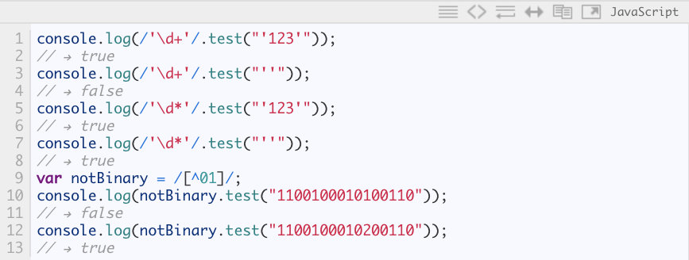
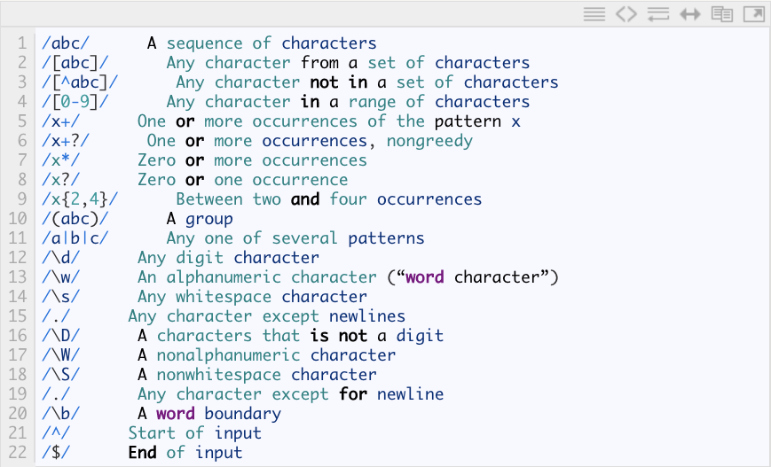

According to Marijn Haverbeke, who wrote [Eloquent JavaScript](http://eloquentjavascript.net/), the regular expression can be described as a quote by Jamie Zawinski:

“Some people, when confronted with a problem, think ‘I know, I’ll use regular expressions.’ Then they have two problems.”

Although this quote is fantastic, and also though Regular Expressions seem like invented by Egyptians with hieroglyphs, the truth is they are really useful to work with strings.

This is your post if you really don’t know what a regular expression is.

Apart from the mandatory lecture of the Eloquent JavaScript book, we are going to see a resume with the basics about what is the RE in javascript. RE is made to find patterns in Strings, and nothing more. You can see if a character or string is included in another string, simply.

You can use the Class RegExp to create a RE or use the shortcut like in the second example (the common use) between slashes.

The simplest example, is to find the pattern in another string we can do the next:

Easy, as you can see you can call the methods directly from /abc/ pattern.

There is a gazillion of shortcuts like that, in reality not too much, to find patterns of numbers, spaces or intros characters, a range of numbers, dates…. etc. Some examples of regular expressions are:

A minimal list as a resume is the next:

You also can take a look at this cheat sheet: [https://www.debuggex.com/cheatsheet/regex/javascript](https://www.debuggex.com/cheatsheet/regex/javascript)

Do you want to learn more about playing games? You can do it from here: [http://regexcrossword.com/](http://regexcrossword.com/)

Please, go to read the book that I told you, apart from starting “talking” perfectly in JavaScript you are going too deep into the programming good methods.

I hope you liked the post and please comment if you like it! Good Programming!
